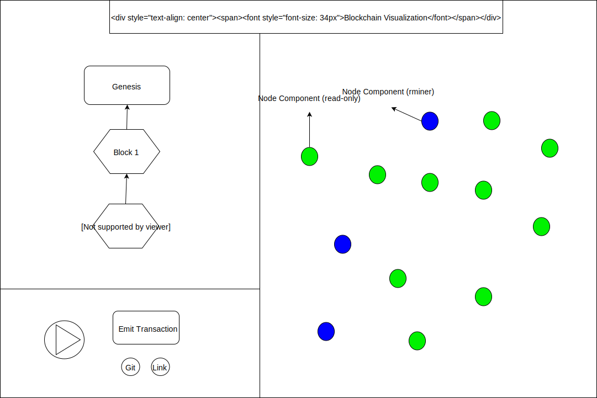

# blockchain-viz
An interactive visualization of the distributed ledger technology known as Blockchain. It is written using the ReactJS library and Redux framework. It was inspired by a visualization for GraphQL, a facebook querying technology that was illustrated by someone here: http://sgwilym.github.io/relay-visual-learners/

## Background
Blockchain is an abstract term used to describe an implementation of a distributed ledger of data that can be thought of as a record of facts that have been validated in varying ways.

Since these data structures are most often talked about in terms of cryptocurrencies, eg. Bitcoin and Ethereum, this visualization will use that domain as a context to illustrate a simple demonstration of how the ledgers work without delving too deeply into how blocks/transactions are verified by consensus. Ultimately, this technology allows for a fast, theoretically sound distribution of pseudo-databases among peers and doesn't require any trust between transacting parties.

For the sake of this illustration, the user must be aware of the following facets of the blockchain technology:

- Any participant can emit a valid transaction to other nodes in hopes that it will be verified by being written into the next block in the chain
- Miners are participants that have the ability to group transactions together and through a guess-and-check process, add a new block of verified transactions to the end of the chain and reap a set reward of cryptocurrency for their work
- When a new block is written, that event is propagated to all other participants in the chain so everyone has the same set of verified facts

## Functionality and MVP
This visualization of the blockchain should allow users to
- Emit a transaction from their node
- Examine a selected block that exists in the chain
- Click on elements to see more information about that component of the blockchain ecosystem

## Wireframes
The window of this app should be split into 3 sections:
 - Blockchain structure
  + The blockchain should render the existing blocks with the data that exists in them available to show a popup window for additional information.
 - Node cluster with miners and other participants
  + The cluster should "randomly" place nodes in the right-side window. These will always be in the same spot though.
 - Control panel
  + This will consist of a Play/Pause toggle button to control the flow of blocks being created and an "Emit Txn" button that the user could see get bundled into a block and then see their txn in the block when it is created on the chain.

## Architecture and Technologies
This will be a React/Redux frontend App. The below components will access the redux store to determine their layout, data and current actions.

Components:
- Blockchain
  + Block
    - genesis block
    - vanilla block
  + BlockDetail
- NodeCluster
  + Node
    - read-only
    - miner
- Controls
  + Play/Pause button
  + Emit Transaction

Sample State-shape:
[Sample State](docs/sample-state.md)

The block components will need a pseudo selector to render a BlockDetail component.

The nodes will be presentational components that can be rendered in the NodeCluster parent component.

Libraries/packages

## Implementation Timeline
Day 1) Set up dev environment with all packages and prepare entry file. Get a root div rendering on the page to view the consensus blockchain. Write the block component and put together diagram of blocks using react-js-diagrams

Day 2 & 3) Write Node component and connect them to center blockchain component. Style the components that are being rendered to be organized on the page. Make clickable dropdowns for info and docs about that piece of the blockchain ecosystem.

Day 4) Randomize block generation from "miner" nodes and get animation to show for the appending of a block to the chain. Create a button for a node to emit a transaction.

## Future Improvements
- Allow user to be a mining node and see if they can click fast enough (do enough work) to get their block added to the chain
- Demonstrate how consensus works and how a 51% attack could be mounted and/or circumvented
- Add specifics about Ethereum's smart contract nodes and show how they interact by letting users emit signals to execute that code on the chain
