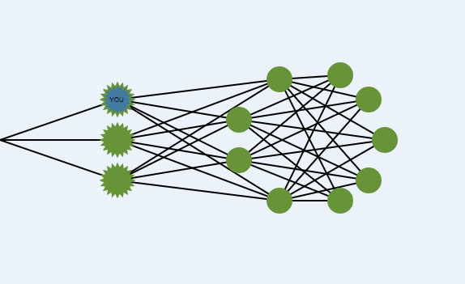
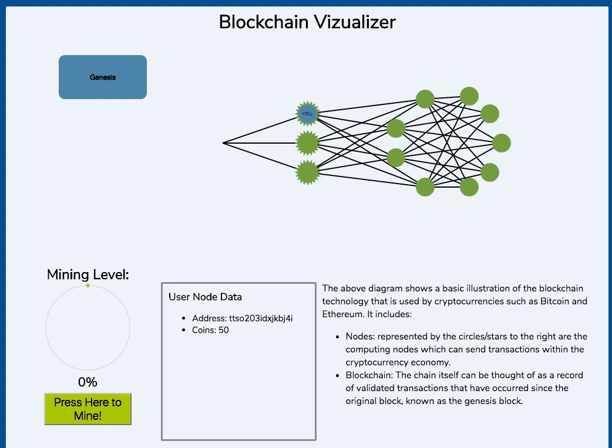
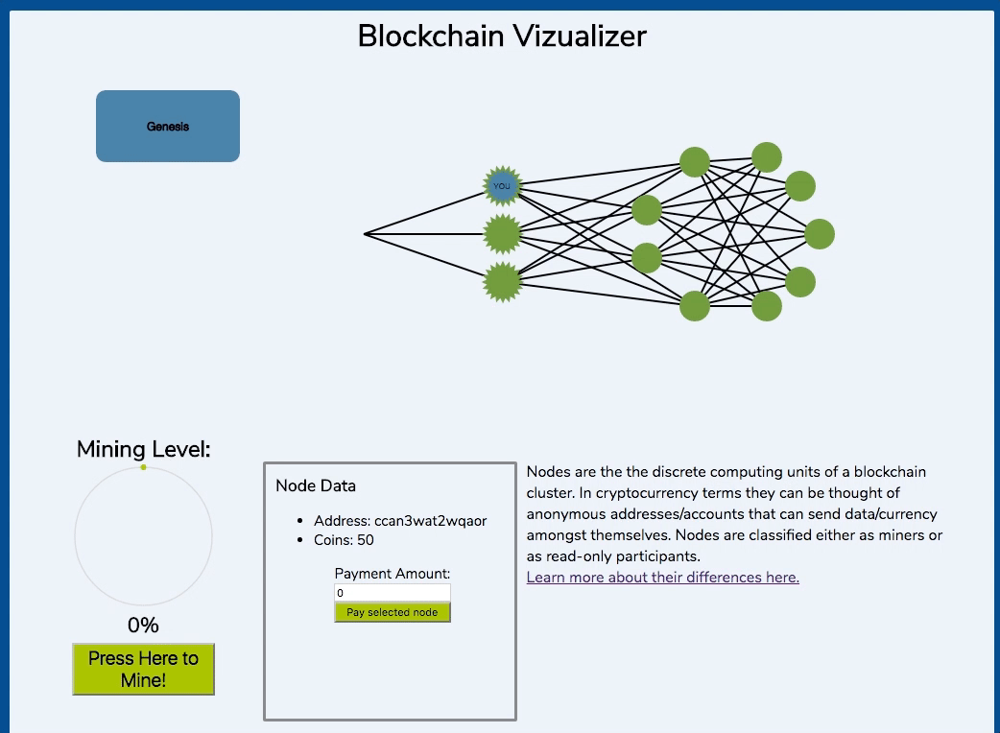
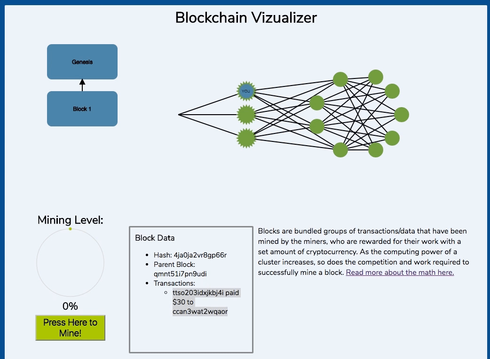

# blockchain-viz
An interactive visualization of the distributed ledger technology known as Blockchain. It is written using the ReactJS library and Redux framework. It was inspired by a visualization for GraphQL, a facebook querying technology that was illustrated by someone here: http://sgwilym.github.io/relay-visual-learners/

As a basic overview, you are a miner node in a cluster of nodes. Make payments to other nodes and mine blocks to reap cryptocurrency rewards.

## Background
Blockchain is an abstract term used to describe an implementation of a distributed ledger of data that can be thought of as a record of transactions/facts that have been validated. This ledger is shared amongst nodes in a peer-to-peer network cluster. A screenshot of the cluster is shown below:

The regular participants are able to make transactions with one another, but the special, star-shaped nodes to the left are miners. The miner nodes are able to, through a series of mathematical guess-and-check processes, add a block to the chain that contains a bundle of now-verified transactions.
Ultimately, this technology allows for a fast, secure distribution of pseudo-databases among peers and doesn't require any trust between transacting parties.

For the sake of this illustration, the user must be aware of the following facets of the blockchain technology:

- Any participant node can emit a valid transaction to other nodes in hopes that it will be verified by being written into the next block in the chain
- Miners are participants that have the ability to group transactions together and add a new block of transactions to the end of the chain and reap a set reward of cryptocurrency for their work
- When a new block is written, that event is propagated to all other participants in the chain so everyone has the same set of verified facts

## Demo

 Above is an example of one full cycle. The user starts out as the top most miner node. After clicking on another node in the cluster, the user has the ability to pay that node a certain amount, not exceeding their current balance. 

Once the transaction is accepted, however, it isn't immediately reflected, it is simply broadcasted to other nodes as an unverified transaction until a miner bundles it into and mines a block on the chain. The user is currently the only node that has the option to mine or transact, but once the user clicks the "mine" button enough and creates a new block, those transaction effects are reflected in all nodes' account balances: 

## Future Improvements
- Allow user to add nodes to cluster and increase mining difficulty proportionately to that
- Demonstrate how consensus works and how a 51% attack could be mounted and/or circumvented
- Add specifics about Ethereum's smart contract nodes and show how they interact by letting users emit signals to execute that code on the chain
